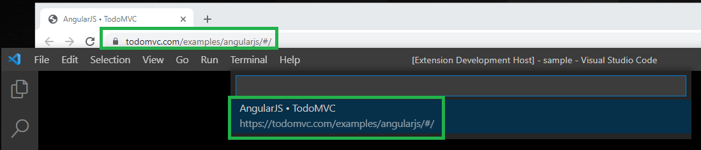
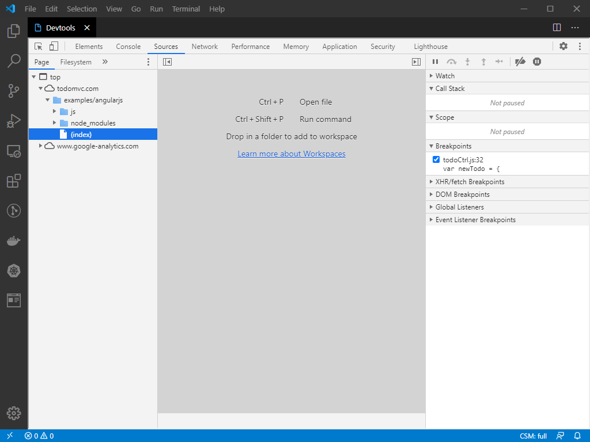
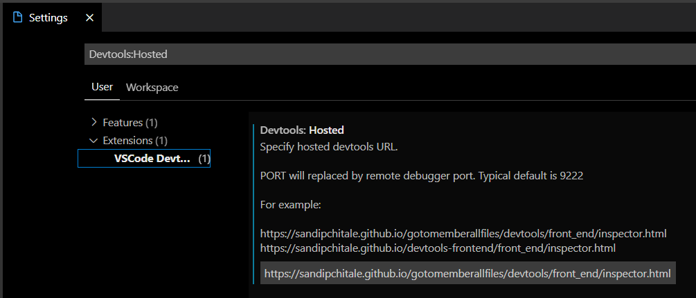

# vscode-devtools

Use built-in or any hosted Chrome Devtools inside VSCode using Webview+iframe.

# How to use?

First run chrome instance in remote debugger mode with:

```
chrome --remote-debugging-port=9222 --no-first-run --no-default-browser-check
```

Alternatively, you can use the command ```Launch Chrome in remote debugging mode```.

Use the command ```Kill Chrome launched in remote debugging mode``` to kill Chrome launched in remote debugging mode.

Use the command ```User default remote debugging port``` to use default remote debugging port.

A statusbar item shows ```Current : Default remote debugging port.```.

Launch Devtools using the command ```Launch Devtools```.

The list of debug targets is shown.



Select the target and the Chrome Devtools will load in a iframe in the Webview based editor.



By default the built in Devtool of the Chrome running in remote debugger mode. However you can specify the URL of any hosted devtools url using the configuration settings ```Devtools: Hosted Devtools Url```.



You can copy the URL to launch Devtools using the ```Copy Devtools launch URL``` command and then paste it in any browser tab. Even Edge or Firefox.

This is a starting point. I am exploring possibilites of integration with VSCode. For example:

* Open resource in VSCode integration
* Workspace mapping

Of course VSCode has bultin debugger for JavaScript (based languages).
